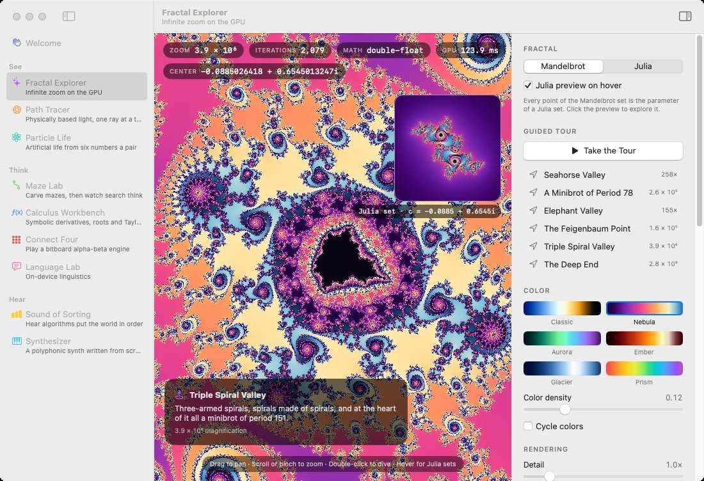
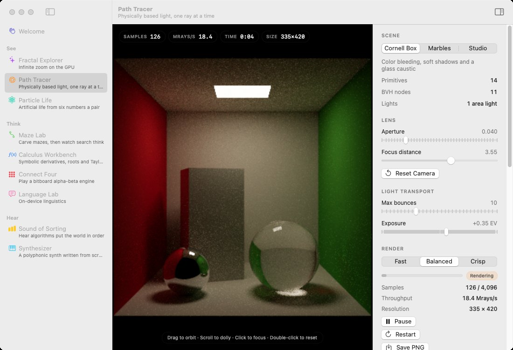
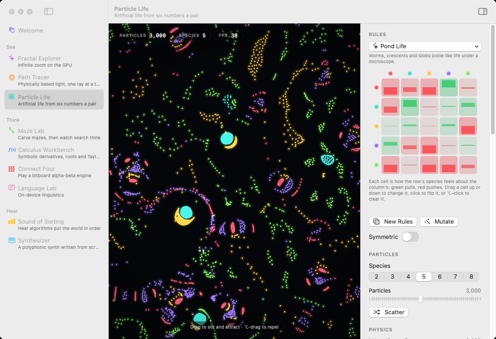
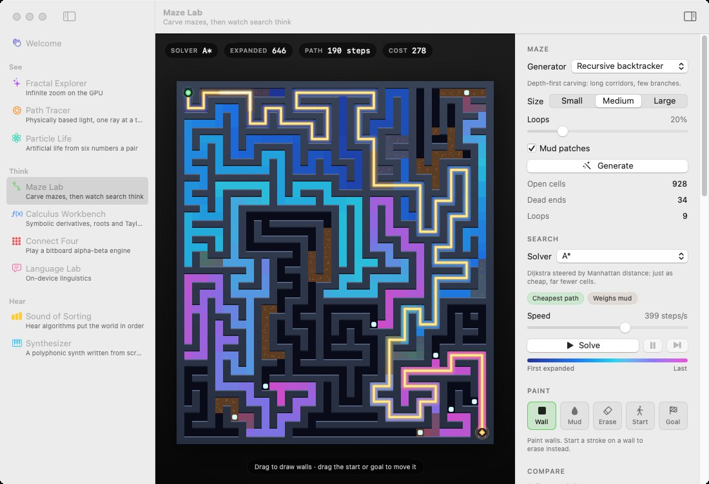
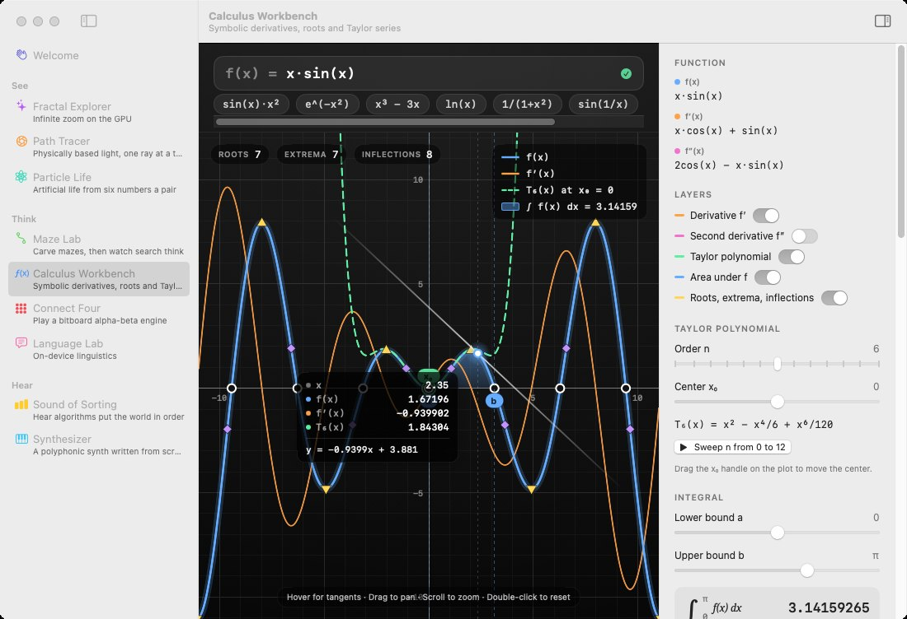
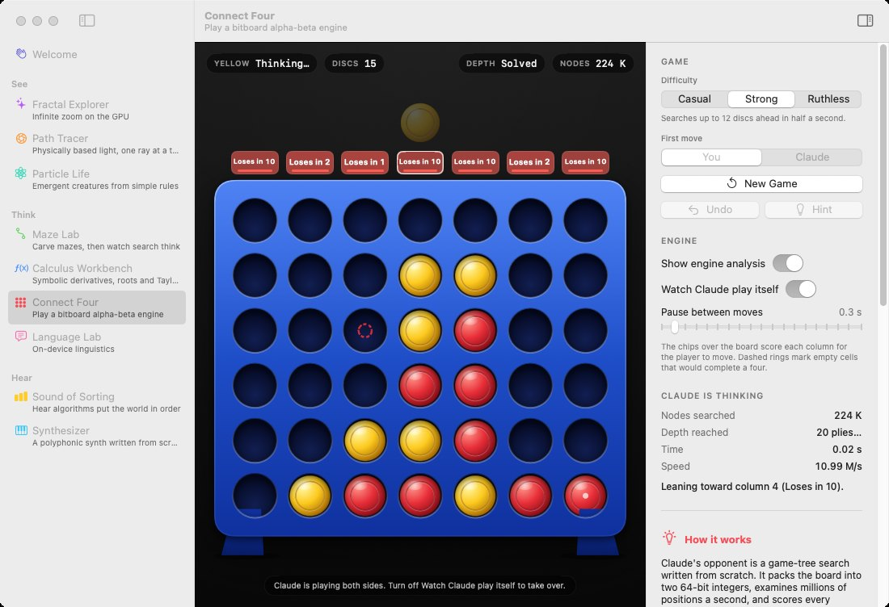
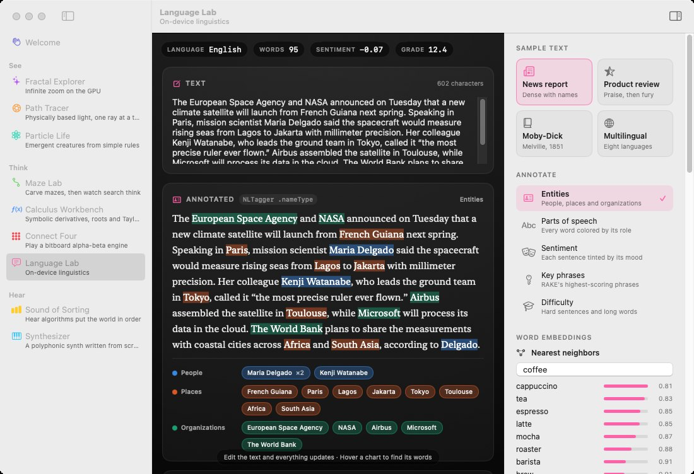
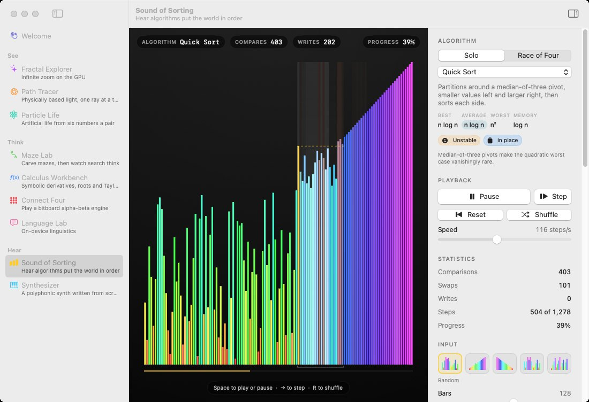
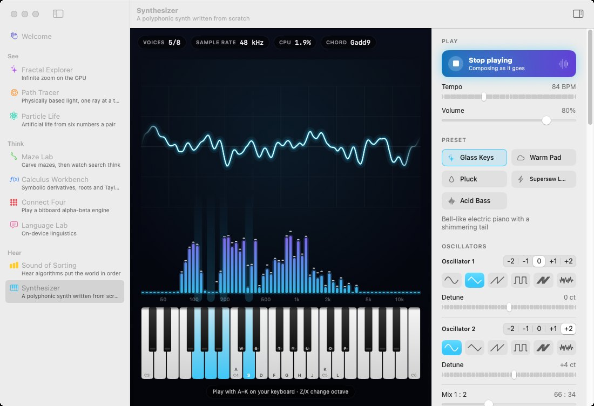

# Menagerie

**A cabinet of computational curiosities: a native macOS app, designed and written by Claude.**

Menagerie is a gallery of nine interactive exhibits. Each one is a small, complete program that shows a different kind of work: GPU programming, physically based rendering, simulation, classic algorithms, computer algebra, game-tree search, natural-language processing and real-time audio synthesis. It is written in Swift with SwiftUI and has no third-party dependencies. Everything runs on your Mac, with no network access.



## The exhibits

| | Exhibit | What's inside |
| --- | --- | --- |
| **See** | **Fractal Explorer** | Mandelbrot and Julia sets in a Metal shader. Past 32-bit precision it switches to double-float arithmetic (TwoSum/TwoProduct), reaching about 10¹⁰× zoom. Includes smooth coloring through Oklab palettes, live Julia previews on hover, and a guided tour of minibrots located by Newton's method along van Wijk–Nuij optimal flight paths. |
| | **Path Tracer** | A progressive Monte Carlo renderer on every CPU core. It has a SAH BVH, next-event estimation with multiple importance sampling, and glass with Fresnel, total internal reflection and Beer–Lambert absorption. A thin-lens camera with click-to-focus and ACES tone mapping finish the image. |
| | **Particle Life** | Thousands of particles in a toroidal world, attracting and repelling by species. A counting-sort cell grid and SIMD8 force kernels keep it fast, and the results are bit-for-bit deterministic. An editable attraction matrix plots its force curve live. |
| **Think** | **Maze Lab** | Seven maze generators, including Wilson's uniform spanning trees and Kruskal's with union–find, and six search algorithms animated cell by cell. Paint walls and mud to watch the route re-solve live, then compare every solver in Swift Charts. |
| | **Calculus Workbench** | A Pratt parser, exact rational arithmetic, symbolic derivatives and a simplifier. Brent root finding, adaptive Simpson integration and Taylor series are all plotted, with hover tangents and draggable bounds. |
| | **Connect Four** | A bitboard engine: negamax with alpha-beta, iterative deepening, a transposition table and Pons's non-losing-move pruning. It shows how it rates every column while it thinks. |
| | **Language Lab** | Apple's NaturalLanguage framework provides language ID, sentiment, entities, parts of speech, word-vector analogies and sentence similarity. A portable engine adds readability formulas, a syllable counter validated against the CMU dictionary, MTLD and RAKE keyphrases. |
| **Hear** | **Sound of Sorting** | Thirteen algorithms, visualized and sonified by a 16-voice synth on `AVAudioSourceNode`. Includes a four-lane race mode. |
| | **Synthesizer** | An allocation-free polyphonic synth: PolyBLEP oscillators, a zero-delay-feedback filter, envelopes, an LFO, chorus, delay and an FDN reverb. A generative sequencer and a keyboard you can play with your computer's keys drive it, and an oscilloscope and spectrum show the output. |

### Gallery

These screenshots come straight from CI: the workflow launches the built app on a macOS runner and captures every exhibit.

| | |
| --- | --- |
|  |  |
|  |  |
|  |  |
|  |  |

## Running it

You need **macOS 14 Sonoma or later**. Building also needs Xcode 15 or later, or its Command Line Tools.

**Install it with a shortcut on your Desktop** (recommended):

```sh
cd Menagerie
Scripts/install.sh
```

This builds the app, installs it in `~/Applications` (no administrator password needed) and puts a **Menagerie** shortcut on your Desktop. It also shows up in Spotlight. Run the script again at any time to update both.

**Or just build the app bundle:**

```sh
cd Menagerie
Scripts/build-app.sh          # add --universal for an Apple silicon + Intel binary
open build/Menagerie.app
```

The build script compiles in release mode, assembles `build/Menagerie.app`, draws the app icon in code, and signs the bundle ad hoc.

**Or run straight from source:**

```sh
cd Menagerie
swift run -c release Menagerie
```

**Or open `Menagerie/Package.swift` in Xcode** and press ⌘R. The heavy engines are compiled with optimizations even in Debug, so the simulations stay smooth.

**Or download a prebuilt app.** Every CI run uploads a universal `Menagerie-app` artifact on the [Actions tab](https://github.com/ligone/something/actions/workflows/menagerie.yml). The app is signed ad hoc, not notarized, so macOS will refuse to open the downloaded copy at first. To allow it, either right-click → **Open**, or go to **System Settings → Privacy & Security → Open Anyway**. You can also run `xattr -dr com.apple.quarantine Menagerie.app`.

## Getting around

| Shortcut | Action |
| --- | --- |
| ⌘0 – ⌘9 | Jump to Welcome or to an exhibit |
| ⌥⌘↓ / ⌥⌘↑ | Next / previous exhibit |
| Toolbar ▸ sidebar icon | Show or hide an exhibit's control panel |

Each exhibit's control panel ends with **How it works**: short notes on the algorithms and techniques behind it.

## How it's built

```
Menagerie/
├── Package.swift        # SwiftPM manifest: engines + the macOS app
├── Engines/             # Portable Swift libraries, one per exhibit
├── Tests/               # XCTest suites for every engine (they pass on Linux too)
├── App/
│   ├── Shell/           # App entry point, navigation, menus, icon, CI tour
│   ├── DesignSystem/    # Shared layout, controls, stage overlays
│   └── Exhibits/        # One folder per exhibit: SwiftUI views + platform glue
├── Scripts/
│   ├── build-app.sh     # Builds, bundles, draws the icon and signs the app
│   └── install.sh       # Installs into ~/Applications with a Desktop shortcut
└── Docs/Screenshots/    # Captured by CI
```

The code is split into two layers:

- **Engines** hold every algorithm: the path tracer, maze generators and solvers, symbolic calculus, the Connect Four search, the particle simulation, the synthesizer's DSP, text analytics and the fractal math. They use only the Swift standard library, Foundation and Dispatch, so they build and test on any platform Swift supports.
- **The app** composes the engines with SwiftUI, AppKit, Metal, AVFoundation, NaturalLanguage and Swift Charts.

[`.github/workflows/menagerie.yml`](../.github/workflows/menagerie.yml) runs the engine tests on Linux and macOS. It then builds a universal app bundle with both the default and the newest Xcode, compiles the runtime Metal shaders, and runs the app through a scripted tour that screenshots every exhibit.

## License

Public domain ([Unlicense](../LICENSE)), like the rest of this repository.
